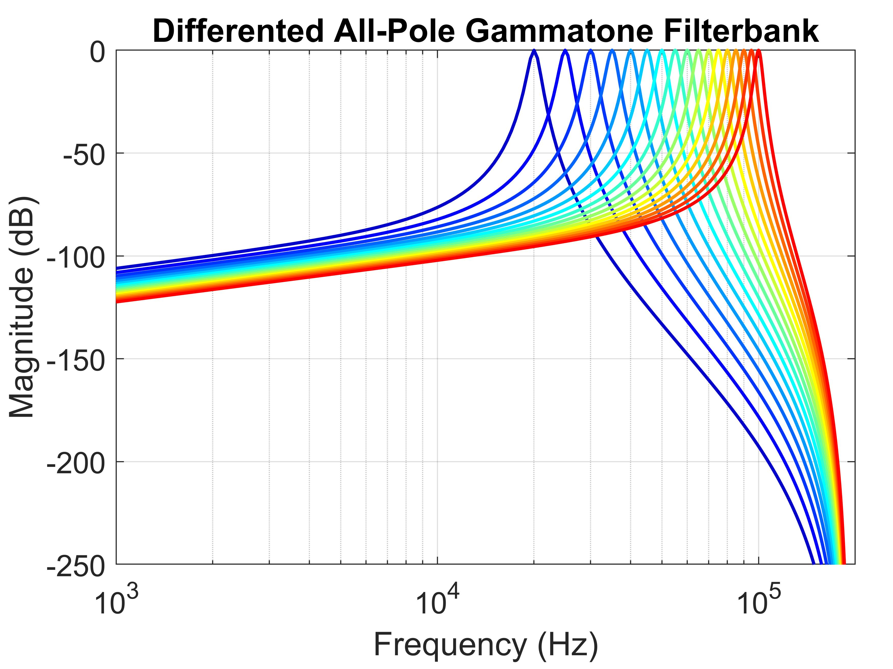

# All-Pole Differentiated Gammatone Filterbank
Gammatone filters have nearly symmetric frequency responses. The program in this project explores a mutation of it - Differentiated All-Pole Gammatone Filter (DAPGF) [1] and create a filterbank based on two parameters, order of the filter N, and quality factor Q. 

## Please run demo.m to plot following figures.

Magnitude reponse of several filters between 20 kHz to 100 kHz. Please notice the asymmetry.

